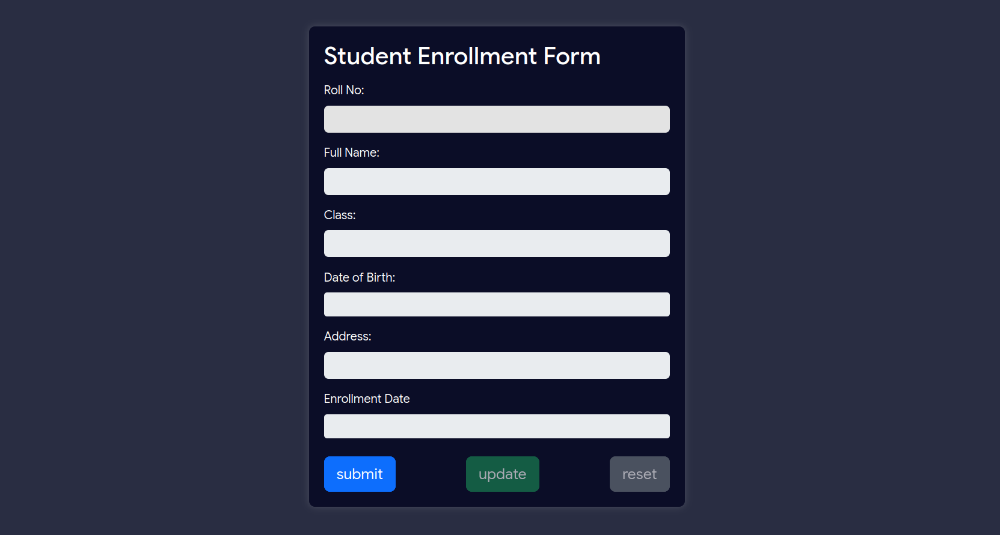
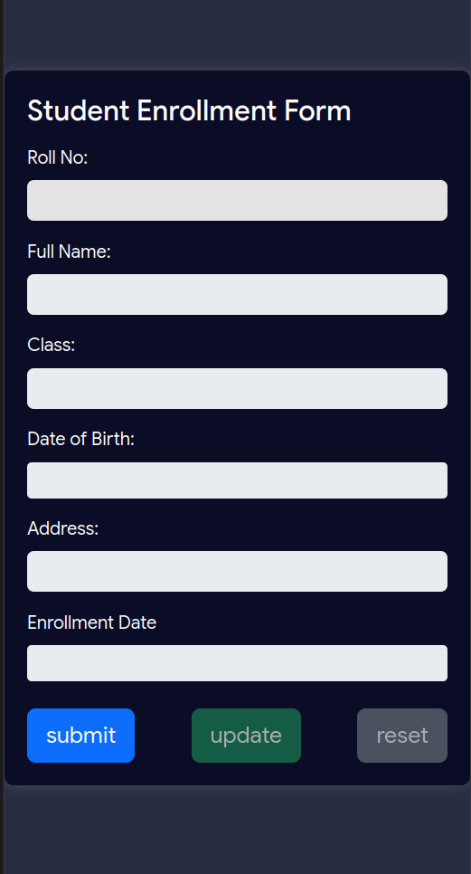

# Student Enrollment Form Project

## Table of Contents

- [Title of the Project](#title-of-the-project)
- [Description](#description)
- [Benefits of using JsonPowerDB](#benefits-of-using-jsonpowerdb)
- [Release History](#release-history)
- [Table of Contents](#table-of-contents)
- [Illustrations](#illustrations)
- [Scope of Functionalities](#scope-of-functionalities)
- [Examples of Use](#examples-of-use)
- [Project Status](#project-status)
- [Sources](#sources)
- [Other Information](#other-information)

## Title of the Project

Student Enrollment Form

## Description

This project is a web-based Student Enrollment Form that allows users to input and manage student data. The form stores data in the JsonPowerDB database, providing a seamless and efficient solution for student information management.

## Benefits of using JsonPowerDB

- JsonPowerDB is a high-performance, NoSQL database that ensures fast data retrieval and storage.
- It supports schema-free JSON data, making it flexible for handling various data structures.
- Easy to use and implement, reducing development time and effort.
- JsonPowerDB provides real-time data integration and multi-mode data processing.

## Release History

- [Version 1.0.0](#) - Initial release of the Student Enrollment Form on GitHub

## Illustrations

### Desktop View

### Mobile View

## Scope of Functionalities

- User-friendly form for entering student details.
- Data stored in JsonPowerDB for efficient retrieval and management.
- Bootstrap styling for an attractive and responsive design.
- Implementation of update, save, and reset functionalities.

## Examples of Use

1. Access the Student Enrollment Form.
2. Enter student details such as Roll No, Full Name, Class, Birth Date, Address, and Enrollment Date.
3. Click the "Save" button to store the data in JsonPowerDB.
4. Use the "Update" button to modify existing records.
5. The "Reset" button clears the form for new entries.

## Project Status

The project is currently in its initial release stage. Additional features and improvements may be added in future releases.

## Sources

- Bootstrap: [https://getbootstrap.com/](https://getbootstrap.com/)
- JsonPowerDB: [https://login2explore.com/jpdb/](https://login2explore.com/jpdb/)
- Bootstrap Datepicker: [https://bootstrap-datepicker.readthedocs.io/](https://bootstrap-datepicker.readthedocs.io/)

## Other Information

For more details, issues, or contributions, please refer to the project repository on GitHub.
